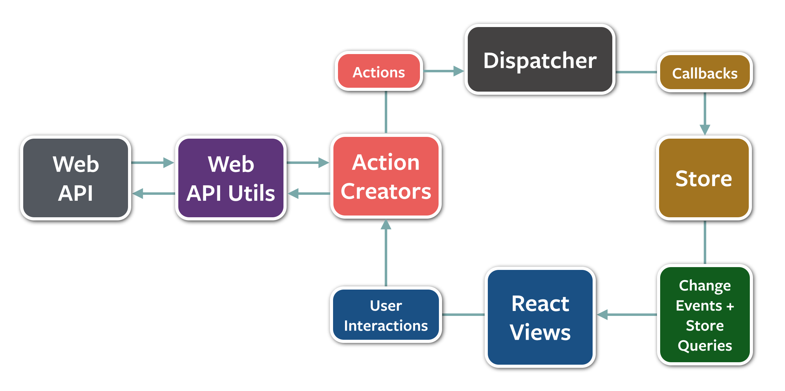
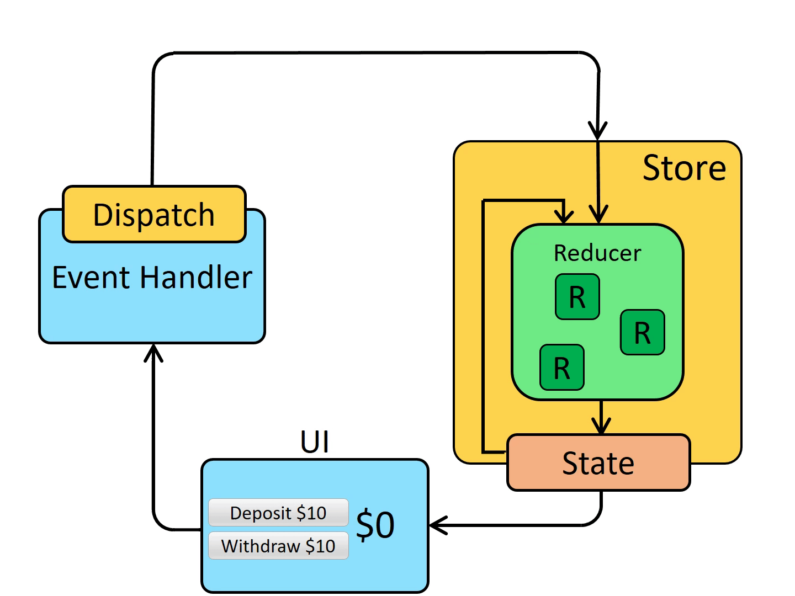

- TODO Go back to the Babel docs
  :LOGBOOK:
  CLOCK: [2022-02-27 Sun 14:10:16]--[2022-02-28 Mon 09:03:50] =>  18:53:34
  CLOCK: [2022-02-28 Mon 09:04:01]--[2022-02-28 Mon 09:04:52] =>  00:00:51
  CLOCK: [2022-02-28 Mon 09:50:38]--[2022-02-28 Mon 23:27:41] =>  13:37:03
  CLOCK: [2023-07-02 Sun 13:27:20]--[2023-07-02 Sun 13:27:21] =>  00:00:01
  CLOCK: [2023-07-02 Sun 13:27:21]--[2023-07-02 Sun 13:27:21] =>  00:00:00
  :END:
- DONE Watch [How to make TypeScript Blazingly Fast (JavaScript/NodeJS)] (https://www.youtube.com/watch?v=Sp5_d6coiqU)
- TODO What does a non-Webpack (or even non-Babel) solution look like?
- LATER Go through the Excalidraw code in-depth (check if there's anything to steal :-)) /
- LATER  Read [Network Protocols - For Anyone Who Knows a Programming Language](https://www.destroyallsoftware.com/compendium/network-protocols?share_key=97d3ba4c24d21147) #free-time
- How to make TypeScript Blazingly Fast
  collapsed:: true
	- [Link](https://www.youtube.com/watch?v=Sp5_d6coiqU)
	- Use a stack trace method to bring down CPU and memory usage.
	- For CPU usage observation - use FlameGraph and check the percentages of CPU usage spent within each function. Sieve out the functions that you manage (aka not the ones governed by Node/WebSockets, or basically whatever big library you're using to manage the system), and refactor them if they take a really long time.
	- For memory usage - use Chrome Developer Tools > Memory > [check] Allocation Sampling box. Read it like the FlameGraph chart.
		- In ThePrimeagen's video, he had multiple bullets being created everytime the player starts to shoot.
		- Instead of creating the bullets over and over again, he optimized by reusing the same objects within a Pool (but with resetting the bullet positions and directions so they won't keep generating from the same spot).
		- To create the Pool, he used a Ring Buffer. I didn't quite catch how this was implemented in JS, but basically you have to do your own memory management. In a ring buffer, you have an insertion point and removal point, and these 2 points run around in circles every time an object is inserted/removed. If your insertion point catches up to the removal point (i.e. in this context - more objects are inserted than removed), then you have to increase the Pool size. If your removal point catches up to the insertion point, then you have to create a new object within the Pool.
	- Notes: This is not related directly to TypeScript per se; only the examples he used within the video was written in TypeScript. This is more of a optimizing CPU and memory within JavaScript and Node kind of video.
- Flux
  collapsed:: true
	- What is Flux?
		- An application architecture that allows for the unidirectional flow of data.
		- It is made possible by having a single source of truth (i.e. the store(s)), and flows this way: Action -> Dispatcher -> Store -> View (our components). This solves the problem of having multiple moving parts in the code in managing data, e.g. asynchronous server responses and client-side unsychronized data.
			- Action
				- Calls the dispatcher.
			- Dispatcher
				- Publishes changes/events that are watched by the stores.
			- Store
				- Subscribes for changes and updates the data accordingly.
			- View
				- Re-renders when a change is emitted after the store updates.
		- 
	- What is the relationship between Redux and Flow?
		- Redux is a small-ish library that takes its design inspiration from the Flux pattern, but is not a pure flux implementation.
		- The main difference is that Redux does not *really* use a dispatcher, but uses pure functions to define data mutating functions (i.e. using Reducer(s)) . Technically, there is a function called `dispatch`, but it dispatches the various action types in the action creators (whereas it's the opposite for Flux, see above).  ==KIV==
		- The main difference is that Redux cuts some complexity by using functional composition, while Flux uses callback registration.
		- 
	-